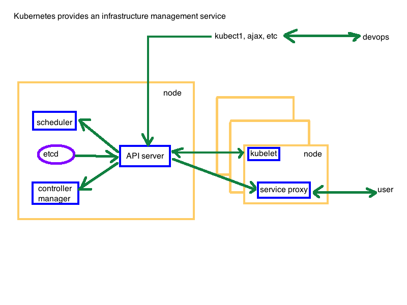
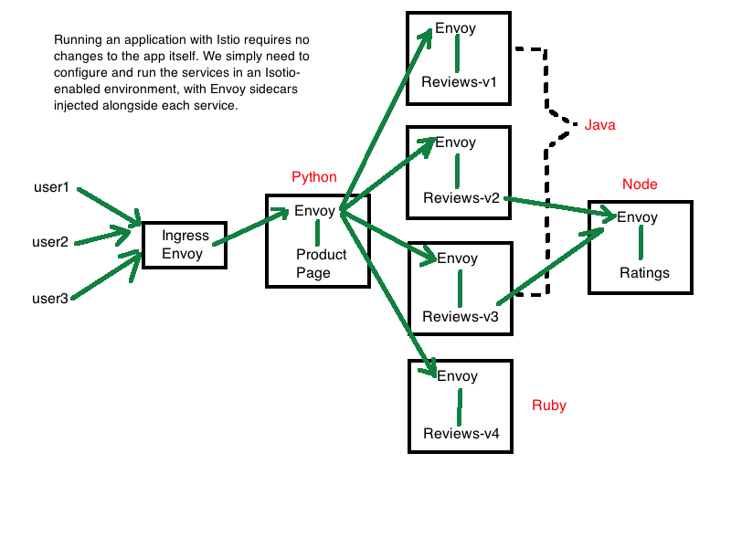

# Istio

Istio is an open source framework for that provides a service mesh for microservices. It provides 

-  `request routing`
-  `load balancing `
-  `service-to-service authentication`
-  `failture management`
-  `fault injection`
-  `circuit breaking`


///////////////////////////////////////
Agenda 

# Microservices, Kubernetes and Istio   
## Microservices   
## Kubernetes   
## Istio   
### Service Mesh   
### Mutual TLS(security)     
### Routing  
### Tracing/Metrics   
### Fault Injection   
## Lab - Get Kubenetes, Istio, Launch an App   
## Lab - Routing  


Microservices are small nuggets of function, and that sounds like it could be simple, but as complexity grows, successful operations require:
```
Visibility(Observability)
    Monitoring
    Metrics
    Tracing
Traffic management
Policy Enforcement
Security
Resilience and efficiency   
```
**A service mesh(an application network for services) can provide the above.**


Kubernetes "native" via platform adapter plugins - also plugs into Mesos, Cloud Foundry, ...

Kubernetes Architecture  



Istio Architecture and Overview   

Istio Components - Istio Pilot     
```
Control plane for distributed Envoy instances
Configures Istio deployment and pushes out configuration to other system components
System of Record for Service Mesh
Routing and resiliency rules
Exposes API for service discovery, load balancing, routing tables  

```


Istio Components - Envoy Proxy   
```
Out of process load balancer
- High performance server/small memory footprint

HTTP/2 AND GRPC support:
- Transparent HTTP/1.1 to HTTP/2 proxy

APIs for Config Management:
- Configuration management via API alone

Advanced Load Balancing:
- Retries, Circuit Breaking, Health Checks, Rate Limits

Observability
- L7 visibility, distributed flow tracing

In Istio:
- Envoy container is injected with istioctl kube-inject or kubernetes initializer
- Congrols pod ingress/egress routing
- Config is via API from Pilot

```

Istio Components - Istio Mixer  
```
Attribute processor that controls the runtime behavior of mesh-attached services
Envoy generates attributes
Mixer then generates calls to backedn infrastructure through adapters
Handlers provide integration for 3rd party tools(Prometheus, grafana, custom tools, ...)
All of these "Istio" pieces are expressed as Kubernetes custom resources(CRDs)

```

Istio functionality -- Mutual TLS
```

```

Istio functionality -- Ingress/Egress
```
Istio assumes that all traffic entering/exiting the service mesh transits through Envoy proxies

Deploying the Envoy proxy in front of services, perators can conduct A/B testing, deploy canary services, etc. for user-facing services.

Routing traffic to external web services (e.g. video service API) via the sidecar Envoy allows operators to add failure recovery features(e.g. timeouts, retries, circuit breakers, etc.) and obtain detailed metrics on the connections to these services.
```


Istio functionality -- Request Routing
```
Request Routing - Service Versions


```


Istio functionality -- Service Observility
```
Service Observility/Visibility

Monitoring & tracing should not be an afterthought

Ideally a monitoring/tracing system should provide:
1 Metrics without instrumenting apps
2 Consistent metrics across fleet
3 Trace flow of requests across services
4 Portable across metric backend providers

Istio adapters seamlessly integrate a number of tools:
Prometheus - gathers metrics from Istio Mixer
Grafana - produces dashboards from Prometheus metrics
Service Graph - generates visualizations of dependencies between services
Zipkin - distributed tracing

```


Istio functionality -- Application and Service Resilience
```
As the number of microservices increase, failure is expected(inevitable?)

Fault-tolerance in aplications is(should be) a requirement.

Istio provides fault tolerance/resilience with no impact on application code

Istioi provides multiple, built-in features to provide fault tolerance:
    Timeouts, Retries with timeout budget, Circuit breakers, Health checks

AZ-aware load balancing w/ automatic failover
Control connection pool size and request load
Systematic fault injection   

```





///////////////////////////////////////

Istio does not require any change to your application code. Istio deploys a special sidecar proxy to each of your application's Pods. 


This proxy, based on the popular, open source Envoy,  intercepts communication between microservices and is configured and managed using Istio's control plane functionality.


