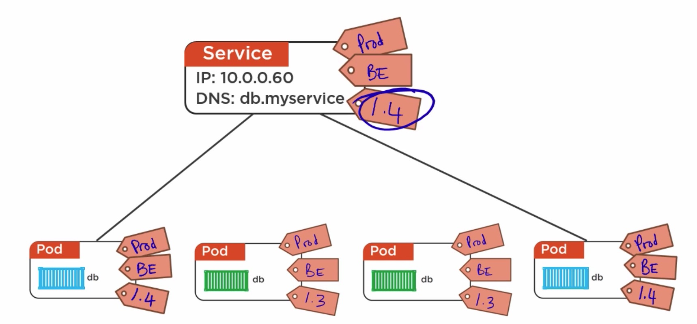

1 Module outline   
1) big picture view    
2) masters   
3) nodes   
4) pods  
5) services   
6) deployments   
7) recap   

/////////////////////////////////////     
//////////   
Kubelet   (node = minion)
```
the main Kubernetes agent
registers node with cluster
watches apiserver
instantiages pods
reports back to master
exposes endpoint on :10255
```

```
/spec   
/healthz   
/pods   
```


//////////     
container Engine   
does container management
```
pulling images
starting/stopping containers 
```

pluggable:
```
usually Docker
can be rkt
```

//////////     
kube-proxy    
kubernetes networking    
```
Pod IP addresses
   all containers in a pod share a single IP   

load balances across all pods in a service  

```


 summary
```
1 Kubelet
main kubernetes agent

2 Container engine
Docker or rkt

3 kube-proxy
Kubernetes networking

```


/////////////////////////////////////     
//////////   
Declarative Model & Desired State   

```
Manifest file:
YAML or JSON, describe desired state
```

```
desired state/record of intent
 3 x nginx pods
         |
         |
         |         
actual state
 3 x nginx pods

```


/////////////////////////////////////     
pods


//////////   
Containers always run inside of pods

Pods can have multiple containers(advanced user-case)


//////////   
Pod

A pod (as in a pod of whales or pea pod) is a group of one or more containers (such as Docker containers), with shared storage/network, and a specification for how to run the containers. A pod’s contents are always co-located and co-scheduled, and run in a shared context. A pod models an application-specific “logical host” - it contains one or more application containers which are relatively tightly coupled — in a pre-container world, they would have executed on the same physical or virtual machine.


```
Ring-fenced environment
1 network stack  
2 Kernel namespaces

n containers

all containers in pod share the pod environment  

```


//////////   
Tight Coupling   


//////////   
Pods and Scaling


//////////   
Pods are Atomic  


//////////   
Pod Lifecycle

```
pending
running
succeeded/failed

```


//////////   
deploying pods

usually via higher level objects(like Replication Controller)  


/////////////////////////////////////     
Services   

Every new pod gets a new IP = IP churn!

```
A Kubernetes Service is an abstraction which defines a logical set of Pods and a policy by which to access them - sometimes called a micro-service. The set of Pods targeted by a Service is (usually) determined by a Label Selector (see below for why you might want a Service without a selector).
```

A Service in Kubernetes is a REST object, similar to a Pod. Like all of the REST objects, a Service definition can be POSTed to the apiserver to create a new instance. For example, suppose you have a set of Pods that each expose port 9376 and carry a label "app=MyApp".

example
```
kind: Service
apiVersion: v1
metadata:
  name: my-service
spec:
  selector:
    app: MyApp
  ports:
  - protocol: TCP
    port: 80
    targetPort: 9376
```

labels rock  



//////////   

//////////   

//////////   

//////////   


/////////////////////////////////////     
deployments


A Deployment controller provides declarative updates for Pods and ReplicaSets.

You describe a desired state in a Deployment object, and the Deployment controller changes the actual state to the desired state at a controlled rate. You can define Deployments to create new ReplicaSets, or to remove existing Deployments and adopt all their resources with new Deployments.

```
self documenting
spec-once deploy-many
simple rolling updates
versioned


rest objects
deployed via YAML or JSON manifests 
```

Simple rolling updates and rollbacks
```
blue-green deployments
canary releases
simple versioned rollbacks
```


example   
controllers/nginx-deployment.yaml(declarative)   
```
apiVersion: apps/v1
kind: Deployment
metadata:
  name: nginx-deployment
  labels:
    app: nginx
spec:
  replicas: 3
  selector:
    matchLabels:
      app: nginx
  template:
    metadata:
      labels:
        app: nginx
    spec:
      containers:
      - name: nginx
        image: nginx:1.7.9
        ports:
        - containerPort: 80
```

//////////   

//////////   

//////////   

//////////   


/////////////////////////////////////     
Objects in the K8s API

```
Pods: automatic unit of scheduling

Replication Controllers: scale pods, desired state etc...

Deployments: RC(Replication Controller) + rolling updates, rollbacks...

Services: Stable networking...


```


//////////   

//////////   

//////////   

//////////   


/////////////////////////////////////     


//////////   

//////////   

//////////   

//////////   


/////////////////////////////////////     


//////////   

//////////   

//////////   

//////////   


/////////////////////////////////////     


//////////   

//////////   

//////////   

//////////   


