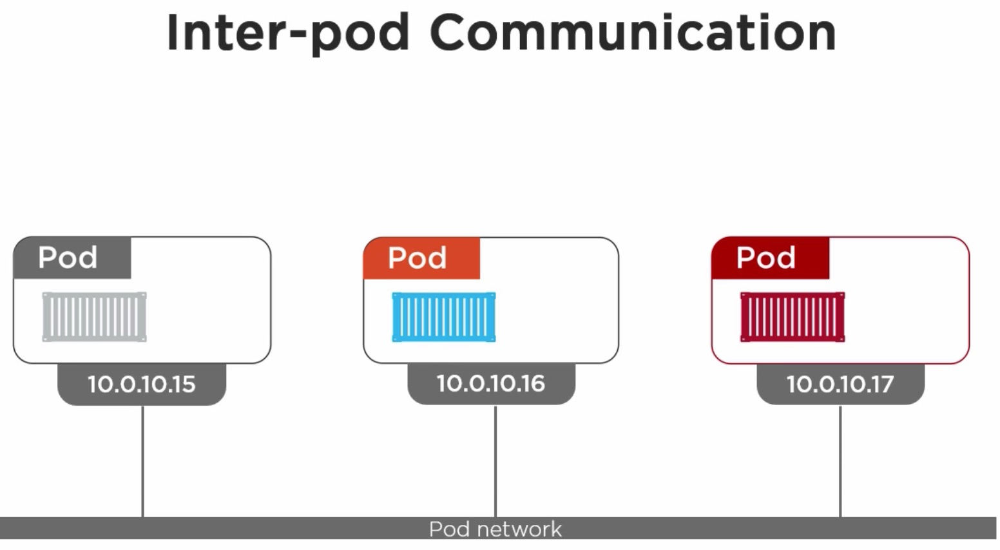

## Pod    

Pods are the smallest deployable units of computing that can be created and managed in Kubernetes.

A pod (as in a pod of whales or pea pod) is a group of one or more containers (such as Docker containers), with shared storage/network, and a specification for how to run the containers. A pod’s contents are always co-located and co-scheduled, and run in a shared context. A pod models an application-specific “logical host” - it contains one or more application containers which are relatively tightly coupled — in a pre-container world, they would have executed on the same physical or virtual machine.

///////////////////////////

//////////

//////////

//////////

//////////

//////////

//////////

//////////

///////////////////////////

//////////

//////////

//////////

//////////

//////////

//////////

//////////