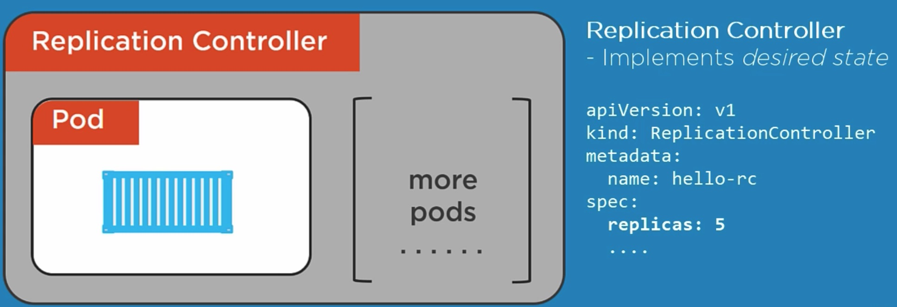

## 

///////////////////////////



```
kubectl delete pods hello-pod
kubectl create -f rc.yml

kubectl apply -f rc.yml

kubectl get rc -o wide

kubectl get pods
```


//////////

//////////

//////////

//////////

//////////

//////////

//////////


///////////////////////////

//////////

//////////

//////////

//////////

//////////

//////////

//////////