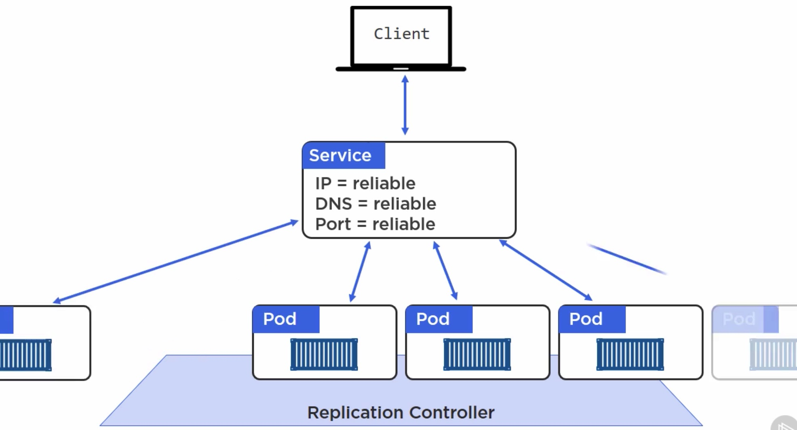

## Kubernetes Services       

///////////////////////////
How do we access our app?
1 from outside the cluster   
2 from inside the cluster  

//////////Services:
what are Services:   
REST objects in the K8s API  
Abstractions    

A Kubernetes Service is an abstraction which defines a logical set of Pods and a policy by which to access them - sometimes called a micro-service. The set of Pods targeted by a Service is (usually) determined by a Label Selector (see below for why you might want a Service without a selector).

//////////

//////////

//////////

//////////

//////////

//////////

///////////////////////////

//////////

//////////

//////////

//////////

//////////

//////////

//////////