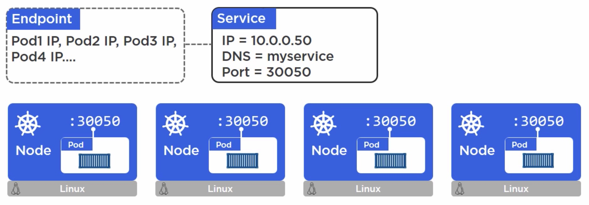
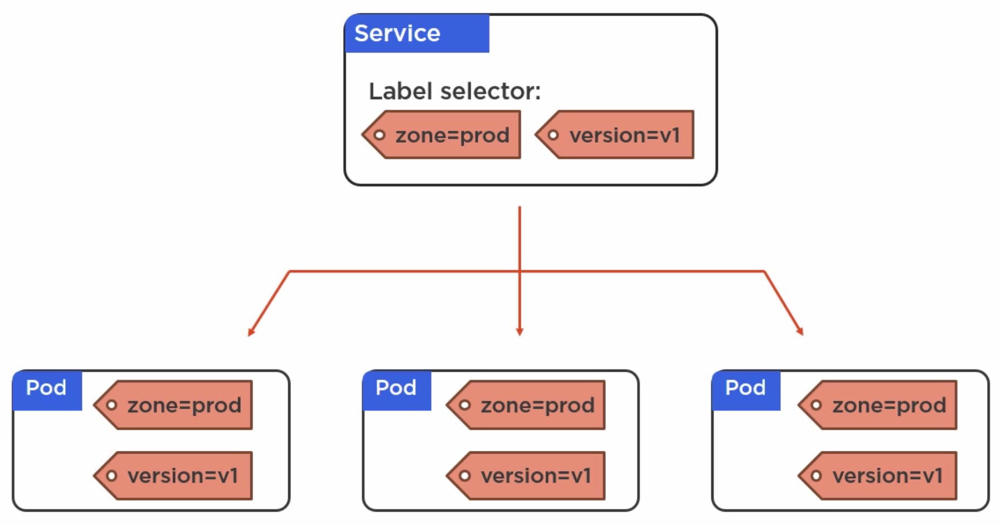

## Kubernetes Services       

///////////////////////////
How do we access our app?
1 from outside the cluster   
2 from inside the cluster  

//////////Services:
what are Services:   
REST objects in the K8s API  
Abstractions    

A Kubernetes Service is an abstraction which defines a logical set of Pods and a policy by which to access them - sometimes called a micro-service. The set of Pods targeted by a Service is (usually) determined by a Label Selector (see below for why you might want a Service without a selector).

Pods are ephemeral, but service never changes(for example, in the following pic, the service's IP, DNS, Port never change no matter how the pods scale) 

Pods are unreiable, but Service is reliable

Each node has the same port number

Use lable to glue service and pods together(we can dynamically change the pods)

//////////Service Discovery
1 DNS based(best option)  
2 Environment variables   

Kubelet = node(the k8s agent on the node)    

//////////
Service gives us a stable networking endpoint for our pods, and they loadbalance across the pods as well.  
Plus, they let us access the pods from outside the cluster

//////////

//////////

//////////

//////////

///////////////////////////

//////////

//////////

//////////

//////////

//////////

//////////

//////////